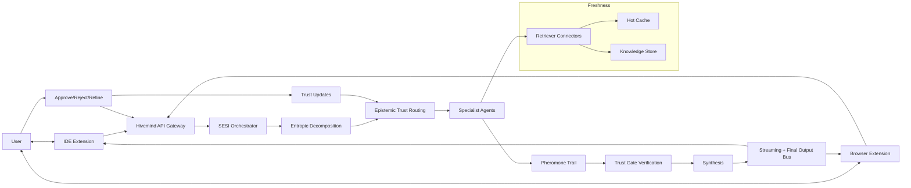

# Hivemind Protocol — Powered by SESI Algorithm

**Stigmergic Epistemic Swarm Intelligence** — A novel multi-agent AI orchestration system where specialized agents collaborate through indirect communication, Bayesian trust, and uncertainty-first task decomposition.

## What Makes This Different

Unlike CrewAI, LangGraph, or AutoGen, SESI doesn't use fixed roles, predetermined graphs, or chat-based coordination. Instead:

| Feature | Traditional Frameworks | SESI |
|---------|----------------------|------|
| Agent selection | Manual/fixed roles | Bayesian trust scores that evolve over time |
| Communication | Direct message passing | Stigmergic pheromone trail (indirect) |
| Task decomposition | Keyword matching or LLM | Shannon entropy (uncertainty-first) |
| Quality control | Optional reviewer | Epistemic trust gates with auto-verification |
| Learning | None | Cross-task Bayesian trust evolution |

## Three Pillars

1. **Stigmergic Pheromone Trail** — Agents don't talk to each other. They deposit typed knowledge artifacts (HYPOTHESIS, EVIDENCE, DECISION, IMPLEMENTATION, CRITIQUE, SYNTHESIS) into a shared trail. Artifacts gain pheromone when referenced and lose it when challenged. Only high-pheromone artifacts survive to synthesis.

2. **Epistemic Trust Model** — Each agent has a Beta-distributed trust score per domain. Trust updates via Bayesian inference after reviews: approved work increases alpha, rejected work increases beta. UCB1-inspired exploration bonuses ensure uncertain agents get calibrated.

3. **Entropic Task Decomposition** — Tasks are decomposed by measuring information entropy across 7 knowledge domains. High-entropy (uncertain) domains execute first, because resolving uncertainty early prevents wasted downstream work.

## System Architecture (Bidirectional)

The platform is not one-way. Users send tasks to the swarm and receive both live progress and final outputs, then provide feedback that updates trust and future routing.



### User Output Channels

- Real-time stream: phase changes, active agents, incremental tokens, partial artifacts
- Final synthesis: complete deliverable package with confidence and metrics
- Feedback loop: user actions (approve, reject, refine) feed trust updates and future task quality

## Quick Start

```bash
# Clone and install
git clone https://github.com/YOUR_USERNAME/Hivemind.git
cd Hivemind
npm install

# Configure
cp .env.example .env
# Edit .env with your Anthropic API key

# Run
node sesi-swarm-server.js

# Open http://localhost:3000
```

## Run Benchmarks

```bash
node benchmark.js
```

Compares SESI vs Legacy Hivemind across 10 diverse tasks measuring decomposition quality, routing intelligence, context efficiency, and cost savings.

## Project Structure

```
Hivemind/
  sesi-swarm-server.js    # Main server (SESI algorithm + embedded frontend)
  benchmark.js             # Performance comparison suite
  agent-swarm.jsx          # React visual demo component
  ALGORITHM.md             # Formal algorithm documentation
  package.json
  Dockerfile
  .env.example
  legacy/
    hivemind-server-v1.js  # Original server (for comparison)
```

## 9 Specialized Agents

| Agent | Role | Primary Domains |
|-------|------|-----------------|
| Nexus | Orchestrator | Decomposition, Synthesis, Routing |
| Scout | Researcher | Requirements, Architecture, Content |
| Architect | Planner | Requirements, Architecture, Frontend, Backend |
| Sage | Senior Architect | Architecture, Infrastructure, Backend |
| Bolt | Frontend Coder | Frontend |
| Forge | Backend Coder | Backend, Infrastructure |
| Core | Systems Coder | Infrastructure, Backend, Quality |
| Quill | Writer | Content, Requirements |
| Sentinel | Reviewer / Trust Gate | Quality |

## API Endpoints

- `POST /api/sessions` — Create a new session
- `POST /api/sessions/:id/run` — Execute a task `{ "task": "..." }`
- `GET /api/sessions/:id` — Get session state + trail stats
- `GET /api/trust` — View current trust profiles
- `GET /api/decompose?task=...` — Preview entropic decomposition
- `WebSocket /ws/:sessionId` — Real-time streaming

## Deploy

```bash
# Docker
docker build -t hivemind-sesi .
docker run -p 3000:3000 --env-file .env hivemind-sesi

# Railway / Render
# Just connect your GitHub repo — it auto-detects the Dockerfile
```

## Algorithm Details

See [ALGORITHM.md](./ALGORITHM.md) for the full formal specification including pseudocode, legal safety analysis, and comparison tables.

## License

MIT

## Author

Biswadeepak — March 2026
